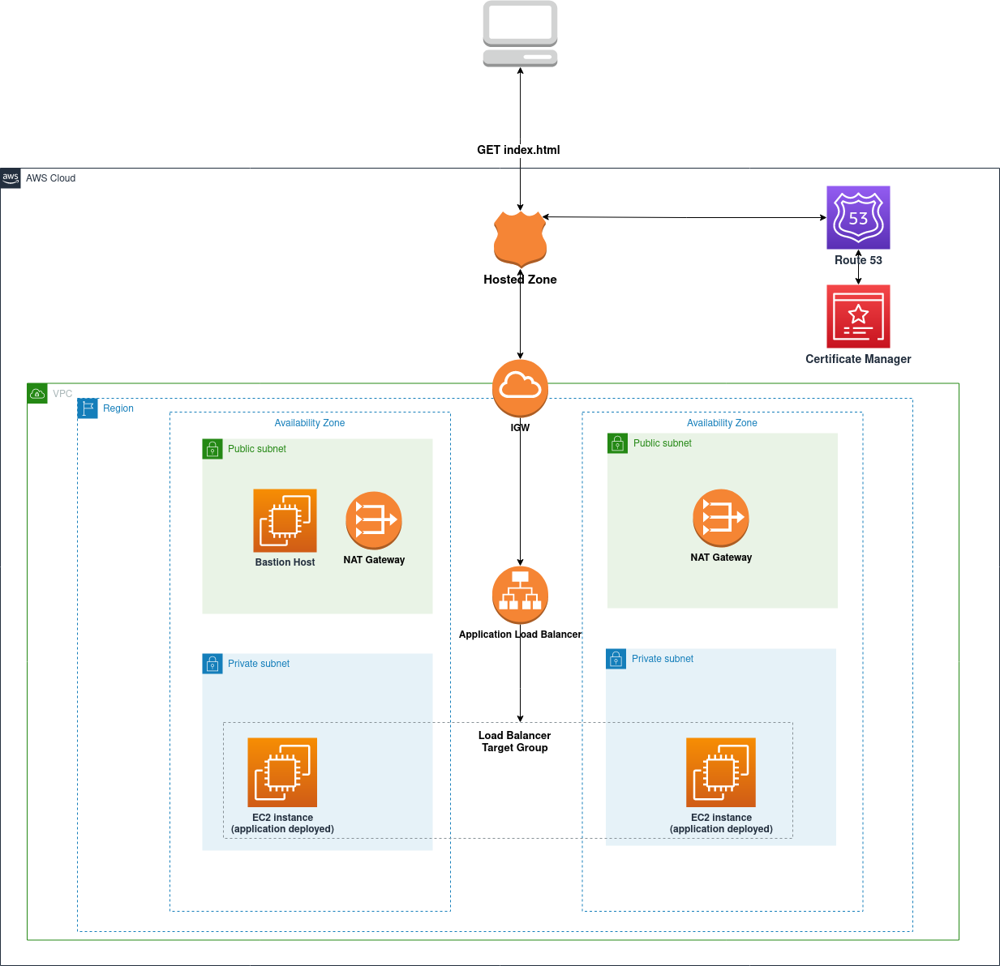

# AWS Application Load Balancer Hosted Website

This repository contains a terraform root module allowing the provisionning of a load balanced website served from AWS on HTTPS.  
The diagram below shows an overview of the different parts provisionned by this module.  

  

## Requirements

### AWS Account Requirements  

Before running any commands, you should ensure that you have:  
  * A hosted zone or subzone within AWS Route 53 service.
  * An SSH key that will be used to access the deplyed ec2 instances through the bastion host when enabled.
  * An S3 bucket used to store the state of the terraform project.

### Terraform Requirements

| Name | Version |
|------|---------|
| terraform | == 0.15.*  |
| aws provider | >= 3.0 |

### System Requirements  

Python3 should be installed with boto3 as a dependency (used to run a script that waits for certificate validation) if you want to create and manage an Amazon issued certificate using this code.  


## Provionning the project

This project can be provisioned from Github Actions Workflows (currently only dev plan/apply are supported), otherwise, in order to manually deploy, the following steps are required:  

  * setting the AWS account key id, secret key and region:
  ```
   export AWS_ACCESS_KEY_ID="My_AWS_ACCESS_KEY_ID"
   export AWS_SECRET_ACCESS_KEY="My_AWS_SECRET_ACCESS_KEY"
   export AWS_DEFAULT_REGION="us-east-1"

  ```
  * setting the S3 remote backend bucket name and key (the (bucket,key) set should be changed per environment).
  ```
   export TFSTATE_BUCKET="My_TFSTATE_BUCKET"
   export TFSTATE_KEY="My_ENV_TFSTATE_KEY"

  ```
  * Initializing the terraform project (downloading modules, providers, etc)
  ```
  terraform init \
  -backend-config="bucket=${TFSTATE_BUCKET}" \
  -backend-config="key=${TFSTATE_KEY}" \
  -backend-config="region=${AWS_DEFAULT_REGION}"
 
  ```
  * Update the variables for the required environment ([dev](env/dev.tfvars), [stg](env/stg.tfvars), [prd](env/prd.tfvars)).
  * Apply the project (You will be prompted to confirm after seeing the planned execution)
   ```
    terraform apply -var-file=env/$env.tfvars
 
  ``` 


## Inputs

| Name                   | Description                                                                                                       | Type                                               | Default  | Comment                                                                                 |
|------------------------|-------------------------------------------------------------------------------------------------------------------|----------------------------------------------------|----------|-----------------------------------------------------------------------------------------|
| app_name               | Used for setting the recordset for the ec2 backed ALB  target group                                               | string                                             | my-app   |                                                                                         |
| environment            | Used for tagging and naming ec2 instances and ALB resources                                                       | string                                             | dev      |                                                                                         |
| instance_keypair       | The keypair name for the ec2 instances                                                                            | string                                             |          |                                                                                         |
| create_bastion         | Create a bastion host when set to true                                                                            | boolean                                            | false    |                                                                                         |
| user_public_ip         | One public ip address, used to limit the ssh access to the bastion host                                           | string (ip address, CIDR notation is not accepted) |          | required only when create_bastion is set to true                                        |
| bastion_instance_type  | The bastion host instance type                                                                                    | string                                             | t2.micro | required only when create_bastion is set to true                                        |
| vpc_name               | The name of the vpc that will be created                                                                          | string                                             |          | required                                |
| vpc_cidr               | The vpc cidr                                                                                                      | string                                             |          |                                    |
| vpc_availability_zones | The vpc availability zones                                                                                        | list of strings                                    |          |                                    |
| vpc_private_subnets    | A list of two vpc private subnets, used for ec2 ALB target group                                                  | list of strings                                    |          |                                    |
| vpc_public_subnets     | A list of two vpc public subnets, used for the bastion Host and the ALB                                           | list of string                                     |          |                                    |
| domain_name            | The domain or subdomain  that will host the ALB recordset                                                         | string                                             |          | Should either be set to different  values for each environment, or change the app_name. |
| create_certificate       | Create a certificate (Self signed or Amazon issued) or provide an already existing certificate ARN         | boolean                                            | true    |                      |
| user_provided_certificate_arn       | Provide a certificate ARN to use for ALB listener (when create_certificate is set to false)         | string                                            |     | The provided certificate  should be fully issued (not pending)                     |
| self_signed_cert       | A self signed certificate will be deployed to ACM, otherwise, il will deploy an Amazon issued certificate ( create_certificate should also be set to true )   | boolean                                            | false    |              |
| cert_validation_timeout       | The timeout in minutes for the certificate validation (when create_certificate is set to true and self_signed_cert is set to false)        | number                                            | 90    | The amazon issued certificate may take a long time to be validated                    |


The private ec2 instances attributes are defined in [ec2.tf](ec2.tf) in the locals block.  
The webserver is installed using a user_data [initialization shell script](scripts/init.sh).  


## Modules

| Name                                     | Version |
|------------------------------------------|---------|
| terraform-aws-modules/ec2-instance/aws   | 3.1.0   |
| terraform-aws-modules/security-group/aws | 4.3.0   |
| terraform-aws-modules/acm/aws            | 3.2.0   |
| terraform-aws-modules/alb/aws            | 6.5.0   |


# TODO
  * Retreive the web server content from an S3 bucket.
  * Use terragrunt to simplify the deployment execution for different environments.
  * Write tests.
